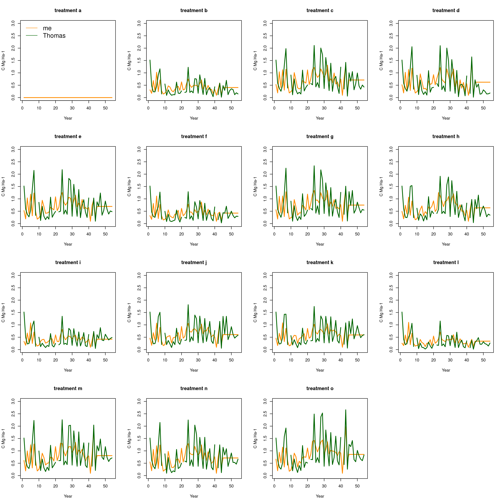
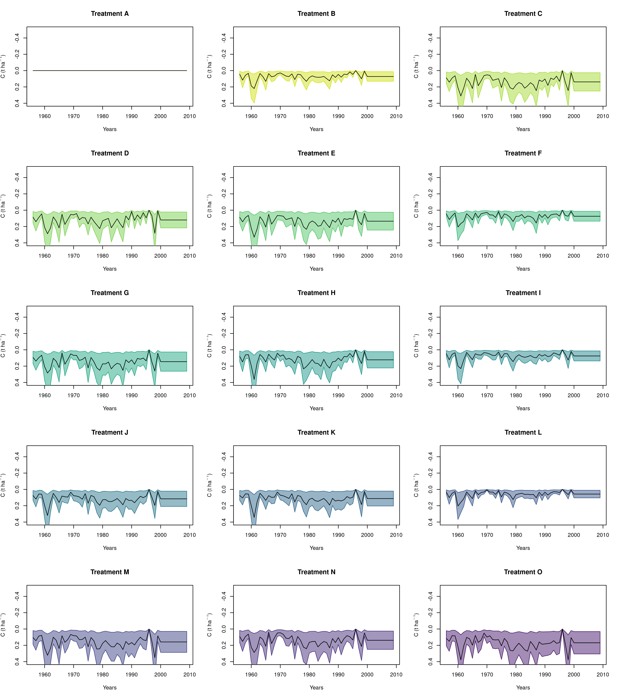
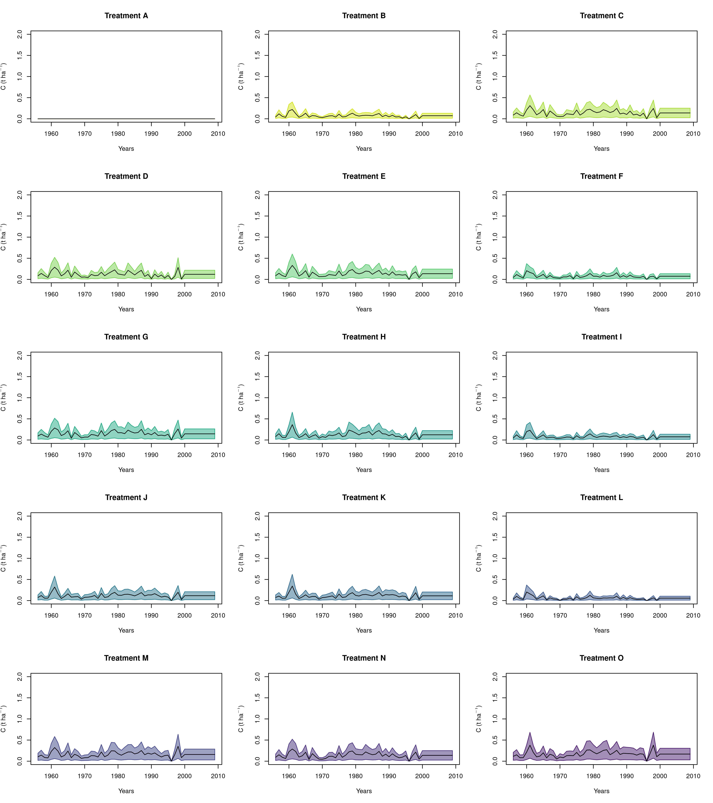

  ```{r setup, include=FALSE}
knitr::opts_chunk$set(echo = TRUE)
library(readxl)
library(RColorBrewer)
library(viridis)
library(hydroGOF)

library(zoo)
library(RColorBrewer)
library(tsoutliers)
library(plyr)
library(imputeTS)
library(lubridate)


library(rjags)
library(coda)
library(modeest)

library(readxl)
library(readODS)
load(file="Pretreatment.Rdata")
Ultuna_treat_vec<-LETTERS[yields_Ultuna[yields_Ultuna$year==1956,]$treat]


```

# Data pretreatment

The initial data are read from the file "input_data_0_36.xlsx", in this foldert. Climatic data are from another calculation, outside this repository.
```{r message=FALSE}
yields_Ultuna<-read_excel("./input_data_0_36.xlsx", sheet=1)
re_Ultuna<-read.csv("../re_clim/Ultuna_FRAME56_calculated_re.csv")[,2:16]
```

Afterwards I create a bulk density time series by interpolating values from 1956 and and from 2017, with one value per each treatment, and then extend this to one value for each plot by repeating the average value.
```{r}
Ultuna_BD_start=1.44
Ultuna_BD_end_list=c(1.43,1.40,1.28,1.21,1.25,1.38,1.21,1.34,1.12,1.24,1.20,1.28,1.05,1.023,1.02)
```
The dimensions of these objects are the same that we will use for most other data treatment objects, either 15 x 62 (treatment level) or 60 x 62 (plot level)
```{r}
dim(Ultuna_BD_timeseries)
dim(Ultuna_BD_timeseries_long)
```

Year 1976, missing, is then filled with an average of all other years for each treatment.
I then create the time series objects, according to this time series:
```{r}
Ultuna_date_vector_year
```

And I fill all the empty years with interpolation, to have one measurement per year. The C% data are then transformed in SOC stocks considering 20 cm depth working with the matrices.
```{r message=FALSE}
depth=20#depth of soil considered in cm
Ultuna_SOC_timeseries_long<-Ultuna_C_timeseries_long_interp*depth*Ultuna_BD_timeseries_long
```

I end up with the following time series for what concerns SOC:

```{r, echo=FALSE,  fig1, fig.height = 6, fig.width = 8, fig.align = "center"}
plot(year(Ultuna_date_vector_year),Ultuna_SOC_timeseries_long[1,],
     col=Ultuna_treat_palette[as.numeric(as.factor(treat_vec[1]))], type="l", ylim=c(0,100), xlab="year", ylab=expression('SOC (Mg ha' ^ -1~')'))
for(i in 1:60){
  lines(year(Ultuna_date_vector_year),na.approx(Ultuna_SOC_timeseries_long[i,]), col=Ultuna_treat_palette[as.numeric(as.factor(treat_vec))[i]], type="l")
  points(year(Ultuna_date_vector_year),as.numeric(Ultuna_SOC_timeseries_long[i,]),
         col=Ultuna_treat_palette[as.numeric(as.factor(treat_vec))[i]], pch=pch_list[as.numeric(as.factor(treat_vec))[i]])
}
legend("topleft", LETTERS[1:15], col=Ultuna_treat_palette, bty="n", lty=1, pch=seq(1:15),cex=0.7)
```

But we later decided to use a calculation from Thomas with a different equivalent soil depth value (the file is in this folder, **Ultuna_SOC_equiv_depth_TK.xlsx**):

```{r, echo=TRUE, results='hide',  message=FALSE,  warning=FALSE, tidy=TRUE, tidy.opts=list(width.cutoff=60)}
Ultuna_SOC_timeseries_long2<-read_excel("./Ultuna_SOC_equiv_depth_TK.xlsx", 
                                        sheet="Ultuna_SOC_stocks")[,-1]
```


Which contains the following data:
```{r, echo=FALSE,  fig1.1, fig.height = 6, fig.width = 8, fig.align = "center"}
plot(as.numeric(Ultuna_SOC_timeseries_long[1,]),
     col=Ultuna_treat_palette[1], type="l", ylim=c(0,120), xlab="year", ylab=expression('SOC (Mg ha' ^ -1~')'))
for(i in 1:60){
   lines(na.approx(Ultuna_SOC_timeseries_long[i,]), col=Ultuna_treat_palette[as.numeric(as.factor(Ultuna_treat))[i]], type="l")
   points((Ultuna_SOC_timeseries_long[i,]),
          col=Ultuna_treat_palette[as.numeric(as.factor(Ultuna_treat))[i]], pch=pch_list[as.numeric(as.factor(Ultuna_treat))[i]])
 }
 legend("topleft", LETTERS[1:15], col=Ultuna_treat_palette, bty="n", lty=1, pch=seq(1:15),cex=0.7)
```


And gives as final input for the calculations, after having averaged for each treatment:
```{r, echo=FALSE,  fig1.2, fig.height = 6, fig.width = 8, fig.align = "center"}
plot(year(Ultuna_date_vector_year_long),calib_data_Ultuna[[1]][1,],
     col=Ultuna_treat_palette[as.numeric(as.factor(treat_vec[1]))], type="l", ylim=c(0,100), xlab="year", ylab=expression('SOC (Mg ha' ^ -1~')'))
for(i in 1:15){
  lines(year(Ultuna_date_vector_year),na.approx(as.numeric(calib_data_Ultuna[[1]][i,])), col=Ultuna_treat_palette[[i]], type="l")
  points(year(Ultuna_date_vector_year_long),calib_data_Ultuna[[1]][i,],
         col=Ultuna_treat_palette[[i]], pch=pch_list[[i]])
}
legend("topleft", LETTERS[1:15], col=Ultuna_treat_palette, bty="n", lty=1, pch=seq(1:15),cex=0.7)
```


Reclim values are read from a separate file, calculated with my package, and are in a matrix 15 x 62 (treatment level) that is the extended to 60 x 62.

```{r, echo=FALSE,  fig2, fig.height = 6, fig.width = 8, fig.align = "center"}
re_Ultuna_plot<- calib_data_Ultuna$re_Ultuna
#re_Ultuna_plot<- re_Ultuna_long
plot(as.numeric(names(re_Ultuna_plot[1,])), (re_Ultuna_plot[1,]), type="l", ylim=c(0.3,1.4), col=Ultuna_treat_palette[1], ylab="re", xlab="years")
for (i in 1:15){
  lines(as.numeric(names(re_Ultuna_plot[i,])), as.numeric(re_Ultuna_plot[i,]),  col=Ultuna_treat_palette[i])
  points(as.numeric(names(re_Ultuna_plot[i,])),as.numeric(re_Ultuna_plot[i,]), cex=0.5,
         col=Ultuna_treat_palette[i], pch=seq(1:15)[i])

}
legend("bottomright", LETTERS[1:15], col=Ultuna_treat_palette, bty="n", lty=1, pch=seq(1:15),cex=0.6)
```

Now there's an additional complication to take care of: since JAGS, the language I used this time for the Bayesian calibration, does not accepts IF loops I have to create a series of input tables if the same 60 x 62 dimensions for each input class.
Each table must then report zero for all treatments not receiving that specific input. The Bayesian calibration then runs for each single plot a model that sums all the possible Y pools, one for each h value, but when the input is 0 of course the Y pool is also zero.

The actual yields values that will be used after this calculation are the following:


```{r, echo=FALSE,  fig3, fig.width = 8, fig.height=5, fig.align = "center"}
plot(Ultuna_yields_timeseries_long[1,], ylim=c(0, max(Ultuna_yields_timeseries_long)), type="l", ylab="Ultuna yields")
for(i in 1:dim(Ultuna_yields_timeseries_long)[1]){
lines(Ultuna_yields_timeseries_long[i,], ylim=c(0, max(Ultuna_yields_timeseries_long)), type="l", col=Ultuna_treat_palette[as.numeric(as.factor(Ultuna_treat_vec))[i]])
}
legend("topright", LETTERS[1:15], col=Ultuna_treat_palette, bty="n", lty=1, pch=seq(1:15),cex=0.6)
```

The crops are reclassified by combining several classes into one in order to use the new S:R values of the new model version(4 classes only). I create some selection vectors to produce then one table for each class with 0 where that class is not planted.

```{r, echo=TRUE, results='hide',  message=FALSE,  warning=FALSE, tidy=TRUE, tidy.opts=list(width.cutoff=60)}
# create one yields vector for each class of Martin's S:R
cereals_vector<-yields_Ultuna$crop=="fodder" | 
                yields_Ultuna$crop=="winter_small_grains" | 
                yields_Ultuna$crop=="spring_small_grains"
roots_vector<-yields_Ultuna$crop=="root_crop"
oil_vector<-yields_Ultuna$crop=="winter_oil_seeds"
maize_vector<-yields_Ultuna$crop=="maize"
```
(the gate "|" in R means "OR")

After a lof of rearrangement, I come up with a list of inputs for the JAGS model:

```{r}
names(calib_data_Ultuna)
```

The result is in the same folder cointaining this report, in ODS format, as **"Input_Ultuna.ods"** and  **"Input_Lanna.ods"**


```{r, echo=FALSE}
library(knitr)
kable(data_descr_Ultuna, caption="The input data structure (here for Ultuna)")
kable(data_descr_Lanna, caption="The input data structure (here for Lanna)")
```


# Calibration (for Ultuna only)

I then run the calibration **only for Ultuna**  
I first make some assumption about the initialization ratio priors, calculating them assuming average re values and average input values and calculating the steady states for a two pool model:  
```{r, eval=FALSE, tidy=TRUE, tidy.opts=list(width.cutoff=60)}
#INIT RATIO PRIORS
mean_re_Ultuna= mean(as.numeric(re_Ultuna_long[21,]), na.rm=T)
mean_I_Ultuna= mean(Ultuna_yields_timeseries_long*10^-3, na.rm=T)
YSS_Ultuna<-mean_I_Ultuna*0.7/(0.8*mean_re_Ultuna)
OSS_Ultuna<-0.15*(mean_I_Ultuna*0.7/(0.0085*mean_re_Ultuna))
Init_prior_Ultuna<-1-YSS_Ultuna/OSS_Ultuna
```
This value (0.9291667) is introduced in the calibration as average, with variance equal to $0.9291667 \cdot 0.2$


### The MCMC model
The model, specified in JAGS, has a loop running for each treatment and a common section where the priors are defined. Here below I report only the prior section.

```{r, echo=TRUE,eval=FALSE, tidy.opts=list(width.cutoff=60)}

  ##Parameters Ultuna
  # Xie, Yajun. 2020. “A Meta-Analysis of Critique of Litterbag Method Used in Examining Decomposition of Leaf Litters.” Journal of Soils and Sediments 20 (4): 1881–86. https://doi.org/10.1007/s11368-020-02572-9.
  k1_ult    ~ dunif(0.78, 1)
  k2_ult    ~ dnorm(0.00605, 1/(0.00605*error_h)) T(0.00605-0.00605*0.5,0.00605+0.00605*0.5)

  h_S_ult     ~ dnorm(0.15,1/(0.15*error_h)) T(0.15-limits_h,0.15+limits_h)
  h_R_ult     ~  dnorm(0.35,1/(0.35*error_h)) T(0.35-limits_h, 1)
  h_FYM_ult   ~ dnorm(0.27,1/(0.27*error_h)) T(0.27-limits_h,0.27+limits_h)
  h_PEA_ult   ~ dnorm(0.59,1/(0.59*error_h)) T(0.59-limits_h, 0.59+limits_h)
  h_SAW_ult   ~ dnorm(0.25,1/(0.25*error_h)) T(0.25-limits_h,0.25+limits_h)
  h_SLU_ult   ~ dnorm(0.41,1/(0.41*error_h)) T(0.41-limits_h,0.41+limits_h)

  #root/shoot ratios priors
  SR_cereals_ult    ~ dnorm(11, 1/(11*error_SR)) T(11-11*error_SR,11+11*error_SR)
  SR_root_crops_ult ~ dnorm(29.49853, 1/(29.49853*error_SR)) T(29.49853-29.49853*error_SR,29.49853+29.49853*error_SR)
  SR_oilseeds_ult   ~ dnorm(8, 1/(8*error_SR)) T(8-8*error_SR,8+8*error_SR)
  SR_maize_ult      ~ dnorm(6.25, 1/(6.25*error_SR)) T(6.25-6.25*error_SR,6.25+6.25*error_SR)


  exudates_coeff ~ dnorm(1.65,1/(1.65*0.1)) T(1.65*0.95,1.65*1.05)

  Init_ratio_Ultuna ~ dnorm(0.9291667,1/(0.9291667*0.2)) T(0.8,0.98)

  stubbles_ratio_Ultuna ~ dnorm(0.04,1/0.01) T(0.02,0.06)
  stubbles_ratio_Lanna ~ dnorm(0.33,1/0.05) T(0.1,0.45)

  C_percent ~ dunif(0.40, 0.51)

  error_h<-0.2
  limits_h<-0.3
  error_SR<-0.25
```


## Inputs and other checks
The input calculation is within the Bayesian calibration, but I extract the mean value from the chains and compare it with former calculation (Thomas in 2011):
```{r, out.width="100%", echo=FALSE}
# All defaults

```
In the same way I can extract and plot separate components of the simulation (the averages shown here), like the fluxes, show here separated for roots and shoots:

```{r, out.width="100%", echo=FALSE}
# All defaults


```
  
Remember here I call "fluxes" the term that sometimes is described as $\phi$ in Thomas literature, which collects many terms together:
$\phi = h \cdot \frac{k_Y r_e Y_0 -i}{(k_O-k_Y)r_e}$  
(this written separately for all classes of inputs, for better description please refer to the Equation description file)

## Predictions
Predictions do not seem to present any problem, but it is indeed pretty easy to calibrate a model with so much freedom, it always work:
```{r, out.width="100%", echo=FALSE}
# All defaults

```


## Posteriors
The issue we need to work on is the posteriors, to have it compatible with the literature.
```{r, out.width="100%", echo=FALSE}
# All defaults
include_graphics("ICBM_posteriors_multisite_specific_portrait.png")
```


